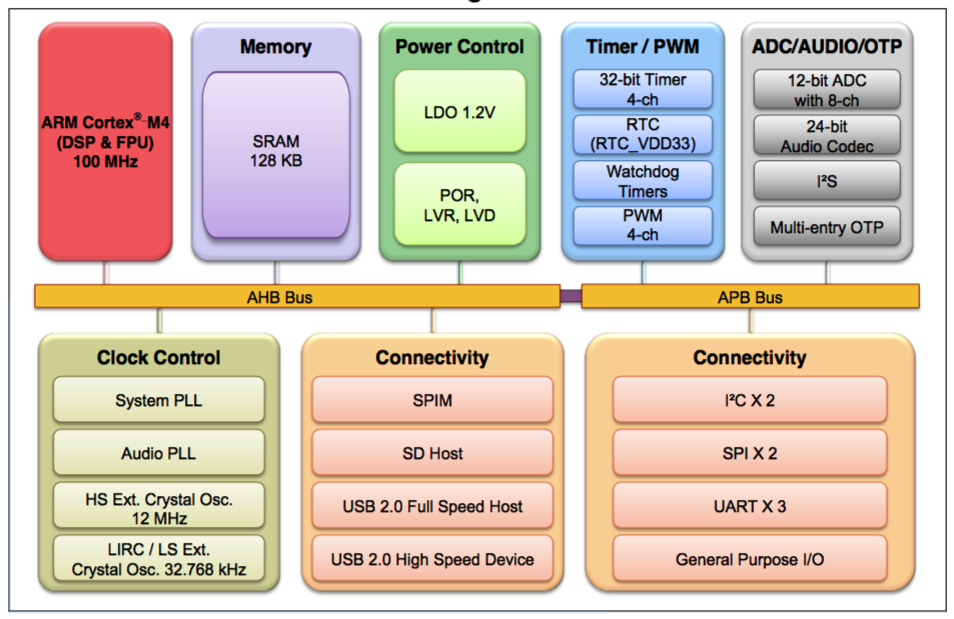

# Nuvoton NUC505

The NuMicro NUC505 series 32-bit microcontroller is embedded with the ARM Cortex-M4F core running up to 100 MHz, supports DSP FPU function, and provides 512 KB / 2 MB embedded SPI Flash memory, and 128 Kbytes embedded SRAM.

The NUC505 series is also equipped with plenty of peripheral devices, such as USB Host/Device, Timers, Watchdog Timers, RTC, UART, SPI, I2S, I2C, PWM Timer, GPIO, 12-bit ADC, 24-bit Audio CODEC, Low Voltage Reset and Low Voltage Detector.

## Hardware

- NuTiny-SDK-NUC505Y User Manual: http://www.nuvoton.com/opencms/resource-download.jsp?tp_GUID=UG0120150209183644
- NuTiny-SDK-NUC505Y Schematics: http://www.nuvoton.com/opencms/resource-download.jsp?tp_GUID=HL0120150213163240

## Software

-  NUC505 Series BSP: http://www.nuvoton.com/opencms/resource-download.jsp?tp_GUID=SW0120141215140101
-  NUC505 Series BSP Readme: http://www.nuvoton.com/opencms/resource-download.jsp?tp_GUID=RM0120151222141552

## Development

### Tools

- Keil MDK-ARM or IAR Embedded Workbench

### Example Code

- NUC505 Series Examples: http://www.nuvoton.com/opencms/products/microcontrollers/arm-cortex-m4-mcus/nuc505-series/Example-Code/?__locale=en&resourcePage=Y

### Programming

- ICP Programming Tool: http://www.nuvoton.com/opencms/resource-download.jsp?tp_GUID=SW0520101208200310
- NUC505 ICP Programming Tool User Guide: http://www.nuvoton.com/hq/resource-download.jsp?tp_GUID=DA01-NUC505
- Nu-Link Command Tool: http://www.nuvoton.com/opencms/resource-download.jsp?tp_GUID=SW0520160317094731

## Reference

- NUC505 Series Overview: http://www.nuvoton.com/hq/products/microcontrollers/arm-cortex-m4-mcus/nuc505-series/?__locale=zh
- NuTiny-SDK-NUC505 User Manual: http://www.nuvoton.com/hq/resource-download.jsp?tp_GUID=UG0120150209183644
- Schematics: http://www.nuvoton.com/hq/resource-download.jsp?tp_GUID=HL0120150213163240
- Datasheet: http://www.nuvoton.com/hq/resource-download.jsp?tp_GUID=DA00-NUC505
- Technical Reference Manual: http://www.nuvoton.com/hq/resource-download.jsp?tp_GUID=DA05-NUC505-SC
- Sample Code: http://www.nuvoton.com/hq/resource-download.jsp?tp_GUID=SW0120141215140101
- Development Resource DVD: http://www.nuvoton.com/NuMicroDVD
