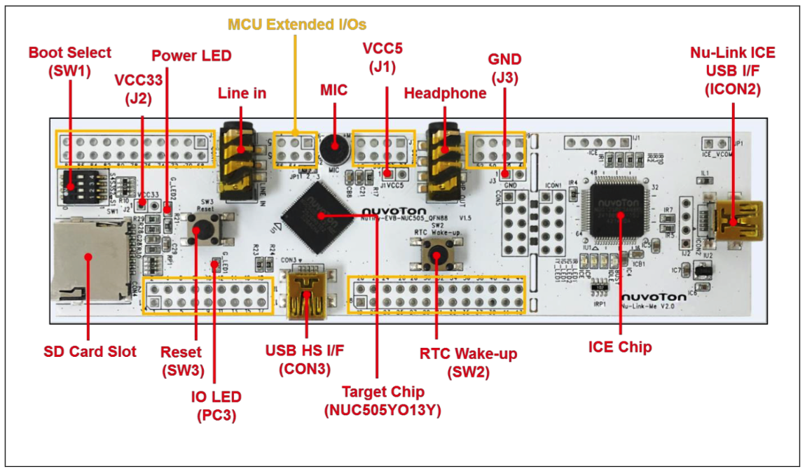
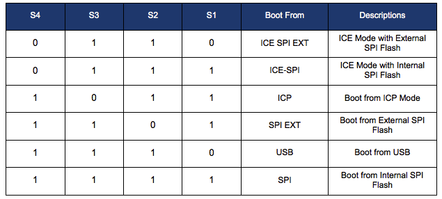
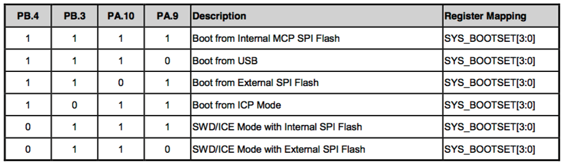
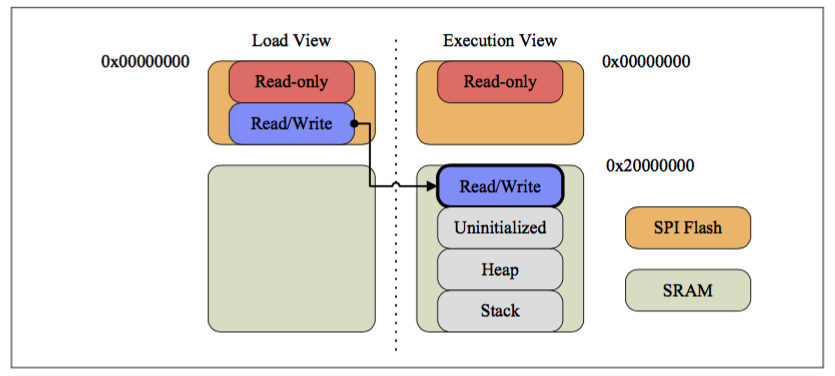
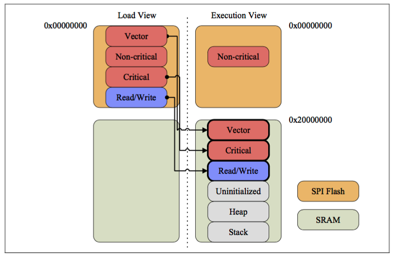
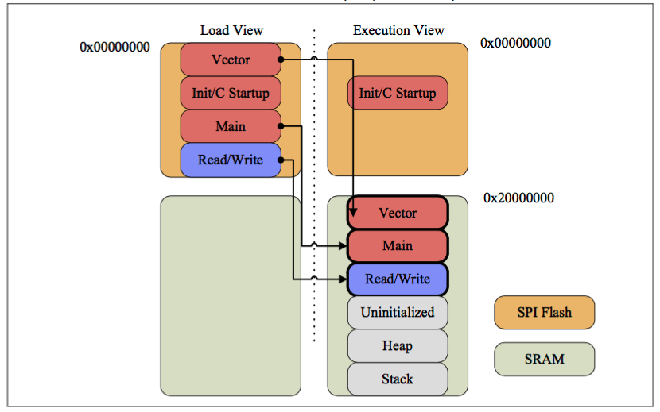
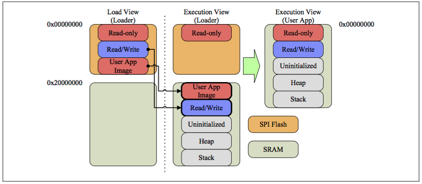
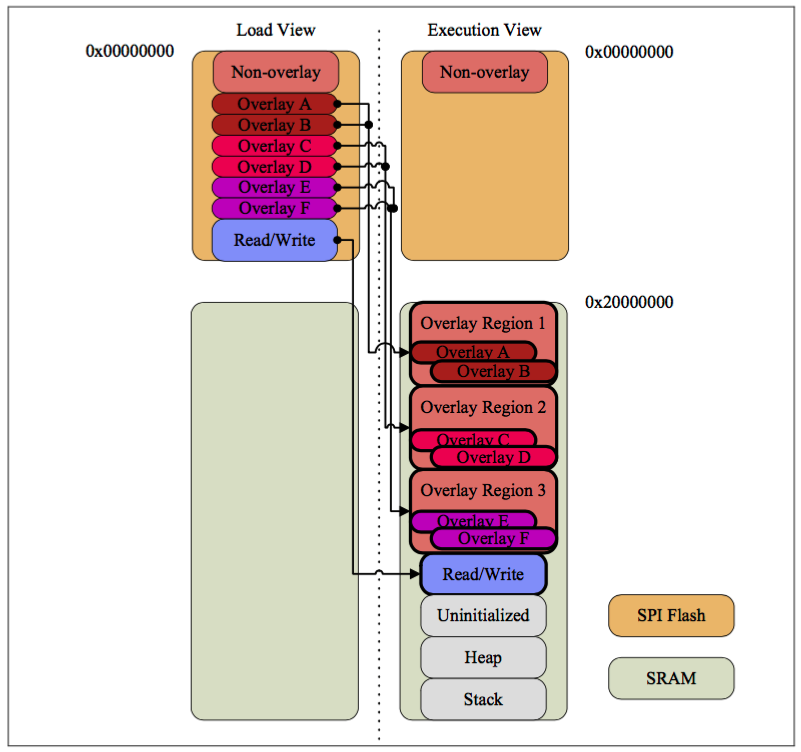

# Nuvoton NUC505

The NuMicro NUC505 series 32-bit microcontroller is embedded with the ARM Cortex-M4F core running up to 100 MHz, supports DSP FPU function, and provides 512 KB / 2 MB embedded SPI Flash memory, and 128 Kbytes embedded SRAM.

The NUC505 series is also equipped with plenty of peripheral devices, such as USB Host/Device, Timers, Watchdog Timers, RTC, UART, SPI, I2S, I2C, PWM Timer, GPIO, 12-bit ADC, 24-bit Audio CODEC, Low Voltage Reset and Low Voltage Detector.

## Hardware

### Board

- NuTiny-SDK-NUC505Y User Manual: http://www.nuvoton.com/opencms/resource-download.jsp?tp_GUID=UG0120150209183644
- NuTiny-SDK-NUC505Y Schematics: http://www.nuvoton.com/opencms/resource-download.jsp?tp_GUID=HL0120150213163240

### Boot Select (SW1) Settings

Typical case:

- Debug in Keil MDK-ARM (UV4): Set SW4-1 to **0111**
- Programming into Internal SPI Flash with ICP: Set SW4-1 to **1011** before programing and then **1111** after programming done

## Software

### BSP

-  NUC505 Series BSP: http://www.nuvoton.com/opencms/resource-download.jsp?tp_GUID=SW0120141215140101
-  NUC505 Series BSP Readme: http://www.nuvoton.com/opencms/resource-download.jsp?tp_GUID=RM0120151222141552

### Example Code

- NUC505 Series Examples: http://www.nuvoton.com/opencms/products/microcontrollers/arm-cortex-m4-mcus/nuc505-series/Example-Code/?__locale=en&resourcePage=Y

## Development

### Environment

- Keil MDK-ARM or IAR Embedded Workbench

### Driver

- Nu-Link Keil Driver: http://www.nuvoton.com/opencms/resource-download.jsp?tp_GUID=SW0520101208200142

  This driver is to support Nu-Link to work under Keil RVMDK Development Environment for all NuMicro Family Devices.

- Nu-Link IAR Driver: http://www.nuvoton.com/opencms/resource-download.jsp?tp_GUID=SW0520101208200227

  This driver is to support Nu-Link to work under IAR EWARM Development Environment for all NuMicro Family Devices.

### Programming

- ICP Programming Tool: http://www.nuvoton.com/opencms/resource-download.jsp?tp_GUID=SW0520101208200310
- NUC505 ICP Programming Tool User Guide: http://www.nuvoton.com/hq/resource-download.jsp?tp_GUID=DA01-NUC505
- Nu-Link Command Tool: http://www.nuvoton.com/opencms/resource-download.jsp?tp_GUID=SW0520160317094731

### Debug

- In-Circut Emulation Debug in Keil MDK-ARM with Nuvoton Nu-Link Debugger

  Load program on-line and run/stop/step/..., set breakpoings, check memory/variables/call stack/...

- Log trace with `printf`
  * To output log into UART, remove **DEBUG_ENABLE_SEMIHOST** define in **Project -> Options for Target -> C/C++ -> Preprocessor Symbols**

    **UART0: TX - PIN 41, RX - PIN 42**

  * With **DEBUG_ENABLE_SEMIHOST** defined, check log in Keil MDK in debug mode at **View -> Serial Windows -> UART #1**

## Boot

### Power-On Setting

### Memory Model

With space and speed taken into consideration, user may apply memory models introduced here to place critical code/data on SRAM for better performance:

- Typical
- Critical on SRAM
- main() on SRAM
- Full on SRAM
- Overlay.

The **Typical** memory model arranges read-only code/data on SPI Flash and the remaining on SRAM, with read/write data differently handled.

Based on the **Typical** memory model, the **Critical on SRAM** memory model moves critical code/data from SPI Flash to SRAM for better performance.

The **main() on SRAM** memory model makes the idea further by moving all code/data to SRAM except unmovable part.

Same as the **main() on SRAM** memory model, the **Full on SRAM** memory model moves all code/data to SRAM with another approach.

The **Overlay** memory model divides a large program into multiple pieces of code/data which are loaded into SRAM when required.

> http://www.nuvoton.com/hq/resource-download.jsp?tp_GUID=DA01-NUC505-1

### Example

Template: https://github.com/robbie-cao/nuc505/tree/master/SampleCode/BootTemplate

## Security

- http://www.nuvoton.com/hq/resource-download.jsp?tp_GUID=DA01-AN0001

## Reference

- NUC505 Series Overview: http://www.nuvoton.com/hq/products/microcontrollers/arm-cortex-m4-mcus/nuc505-series/?__locale=zh
- NuTiny-SDK-NUC505 User Manual: http://www.nuvoton.com/hq/resource-download.jsp?tp_GUID=UG0120150209183644
- Schematics: http://www.nuvoton.com/hq/resource-download.jsp?tp_GUID=HL0120150213163240
- Datasheet: http://www.nuvoton.com/hq/resource-download.jsp?tp_GUID=DA00-NUC505
- Technical Reference Manual: http://www.nuvoton.com/hq/resource-download.jsp?tp_GUID=DA05-NUC505-SC
- Sample Code: http://www.nuvoton.com/hq/resource-download.jsp?tp_GUID=SW0120141215140101
- Development Resource DVD: http://www.nuvoton.com/NuMicroDVD
